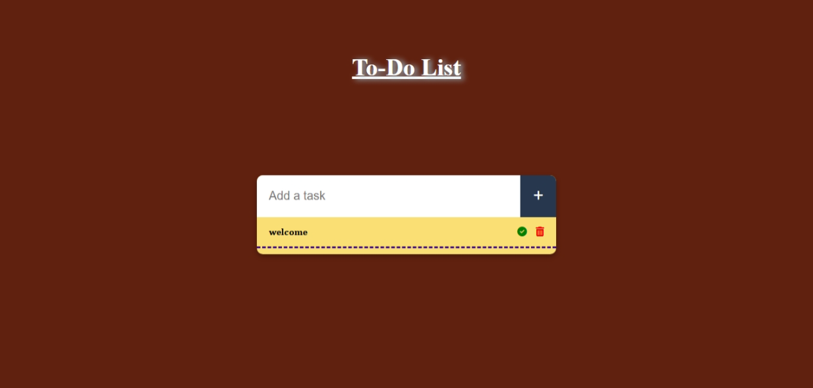
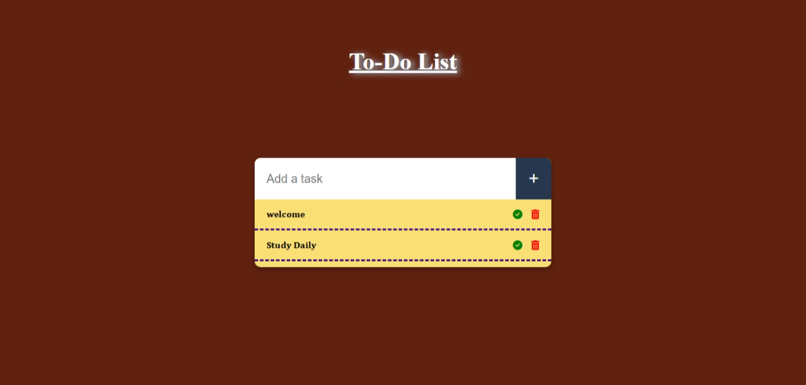
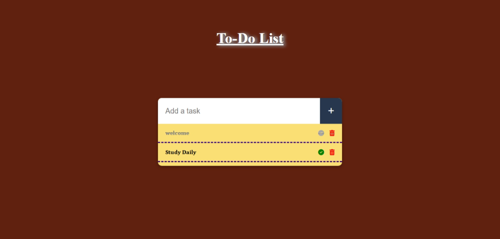

# 📝 To-Do List Web App

A simple and stylish To-Do List application built using **HTML**, **CSS**, and **JavaScript**. It helps users to add, check off, and delete tasks with local storage support, so your tasks stay saved even after a page reload.

## 🚀 Features

- ✅ Add new tasks easily
- ✔️ Mark tasks as completed
- 🗑️ Delete tasks with a click
- 💾 Automatically saves tasks in browser's local storage
- 🎨 Beautiful UI with Font Awesome icons
- 🔒 Input validation for empty tasks

## 🔗 Live Demo

👉 [Click here to try the app](https://msdhinesh45.github.io/To-Do-list-/)


## 📸 Screenshots

| Home View | Task Added | Task Completed |
|-----------|------------|----------------|
|  |  |  |

## 🛠️ Technologies Used

- HTML5
- CSS3
- JavaScript (ES6)
- Font Awesome Icons

## 🧾 How to Use

1. Clone the repository:
   ```bash
   git clone https://github.com/msdhinesh45/To-Do-list-.git
   cd To-Do-list-
2. Open index.html in your browser.
